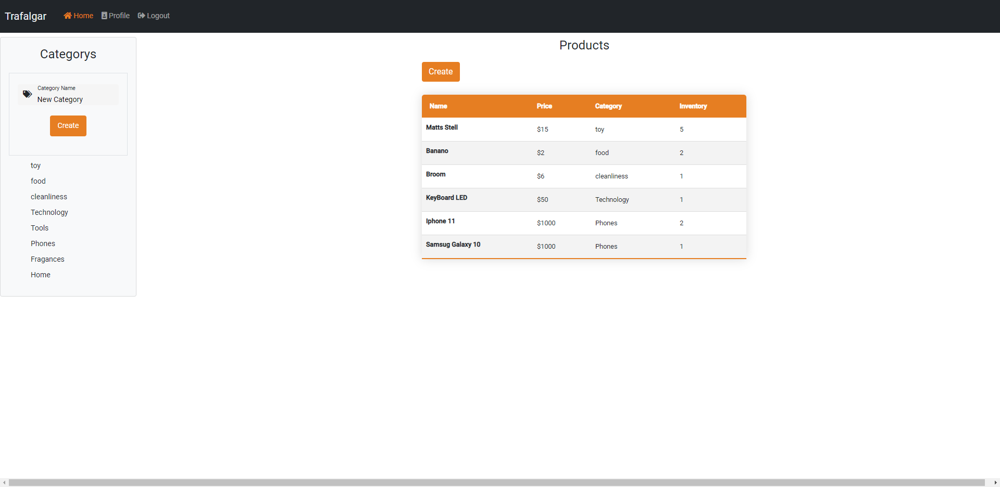

# SmartSoft Technical Test


## Trafalgar is a App Web where we can Register, Login, Create, Read, Update and Delete (CRUD) Products!

### Register


Page where can register how user, with the next fields:

- Frist Name
- Last Name
- Email
- Password

### Login


Page where you enter user, with the next fields:

- Your Email with the register
- Your Password with the register

### Home


Page where Display all Products Created

### Create Category



On the Create Category button, click and display the Create New Category input field.

### Create Product


Page where can create your product, with the next fields:

- Name Product
- Price
- Inventory
- Category

### Edit Product


Page where can edit your product and Delete Product

### Products For Category


Page where can query products for category

### Profile


Page where can Update your data Profile and Delete User!

# Backend

This Proyect is made with NodeJS + Express, Postgres + TypeORM + TypeScript, the Backend is 100% separate from the Frontend.

## Installation

```
git clone https://github.com/AraqueGD/SmartSoft_TechnicalTest.git
cd backend
npm install
npm run dev
```

# Frontend

Frontend is made with Angular

## Installation

```
cd frontend
npm install
npm run start
```

# Improvements for the Future

- LazyLoads
- User to Products Auth in Create, Update, Delete
- Redis Cache
- Backend Deploy with Docker (Nginx Proxy Reverse)

# Author

- Camilo Araque <https://github.com/AraqueGD>
