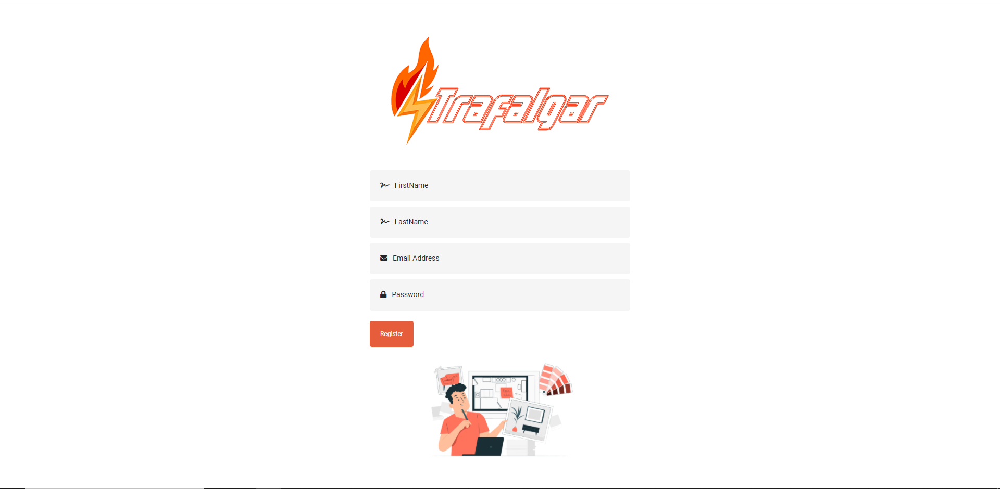
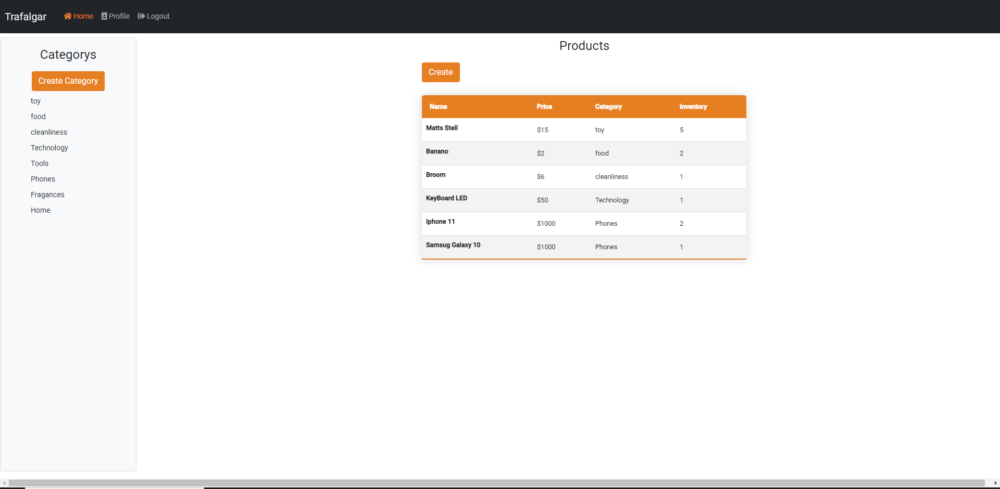
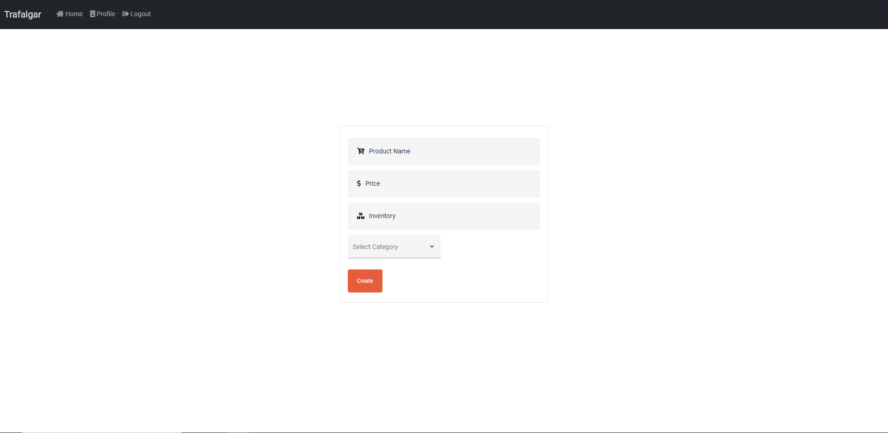
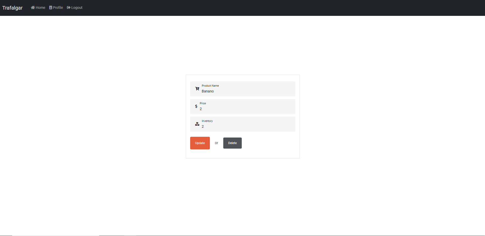
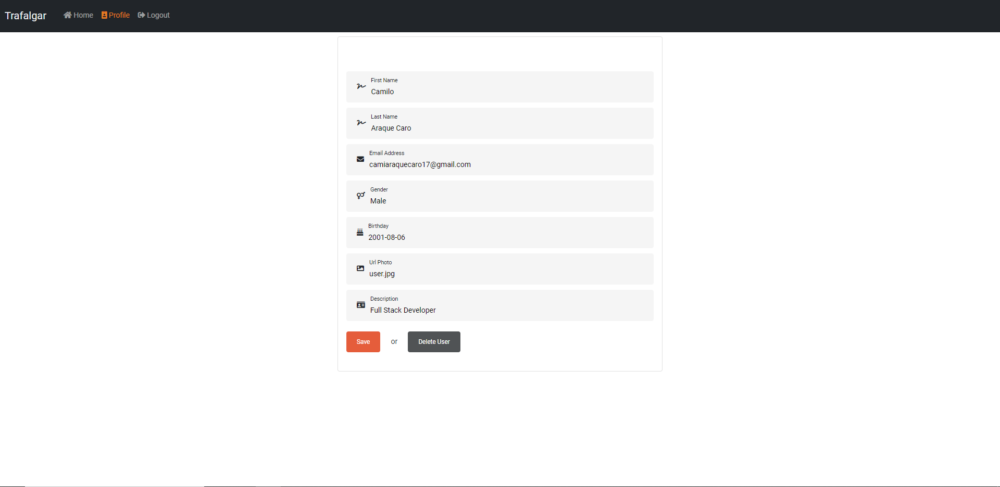

# SmartSoft_TechnicalTest


## Trafalgar is a App Web where we can Register, Login, Create, Read, Update and Delete (CRUD) Products!

### Register



Page where register how user, with the fields completes:

- Frist Name
- Last Name
- Email
- Password


Page where login your user, with the fields completes:

- Your Email with the register
  -Your Password with the register



Page where Display all Products Created


In Button Create can Category this click, display Input Field Create New Category



Page where can create your product, with the fields completes:

- Name Product
- Price
- Inventory
- Category



Page where can edit your product and Delete Product


Page where can query products for category



Page where can Update your data Profile and Delete User!

# Backend

This Proyect is made with NodeJS + Express, Postgres + TypeORM + TypeScript, the Backend is 100% separate from the Frontend.

## Installation

```
git clone https://github.com/AraqueGD/SmartSoft_TechnicalTest.git
cd backend
npm install
npm run dev
```

# Frontend

Frontend is made with Angular

## Installation

```
cd frontend
npm install
npm run start
```

# Improvements for the Future

- LazyLoads
- User to Products Auth in Create, Update, Delete
- Redis Cache
- Backend Deploy with Docker (Nginx Proxy Reverse)

# Author

- Camilo Araque <https://github.com/AraqueGD>
